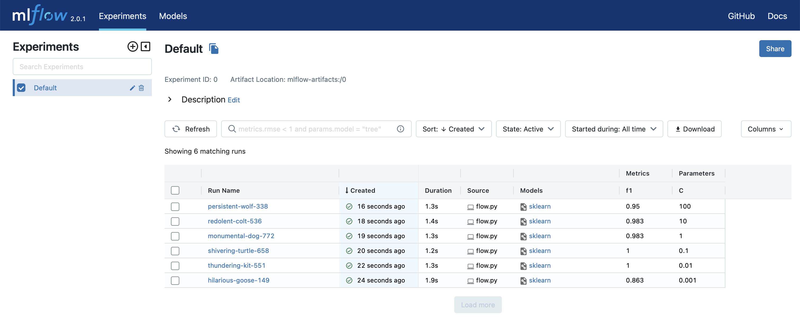

# Template for Machine Learning projects

## Tools used in the projects

| Name    | Description                  | Docs                                      |
| ------- | ---------------------------- | ----------------------------------------- |
| Prefect | For pipeline orchestration   | https://docs.prefect.io/                  |
| Mlflow  | For experiment tracking      | https://mlflow.org/docs/latest/index.html |
| Bentoml | For model deployement        | https://docs.bentoml.org/en/latest/       |
| Hydra   | For an elegant configuration | https://hydra.cc/docs/intro/              |

## How use it

### Create a project

```bash
cookiecutter https://github.com/pierrerochet/cookiecutter-prefect-mlflow-bentoml
```

### Install python dependencies

```bash
make activate
make install_dependencies
```

### Connect your mlflow instance

Modify `TRACKING_SERVER_URI` variable in `/conf/main.yaml` or create a local mlflow instance with `make mlflow_server`

### Test by running a flow

The template already contains an example. So you can run directly to test it.

```bash
make flow
```

### Check the results in your mlflow ui.


